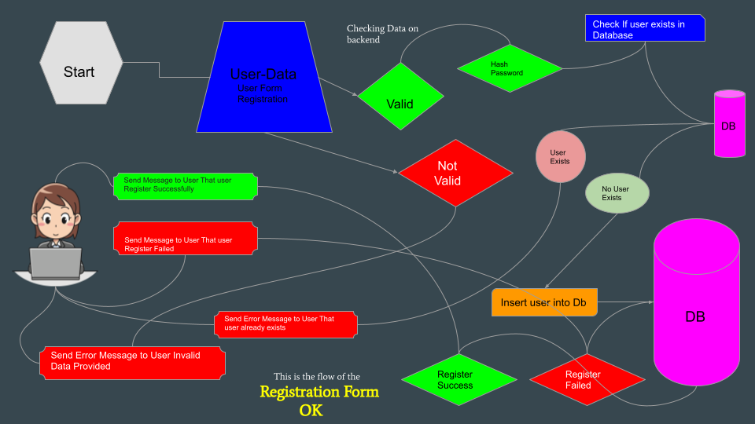
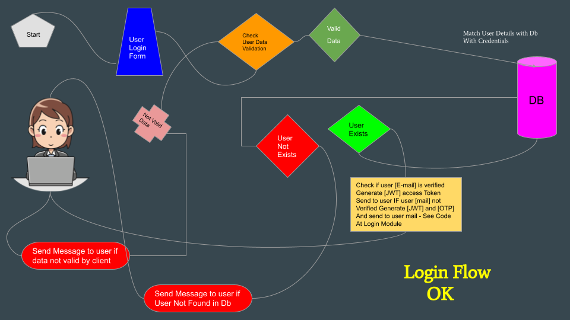
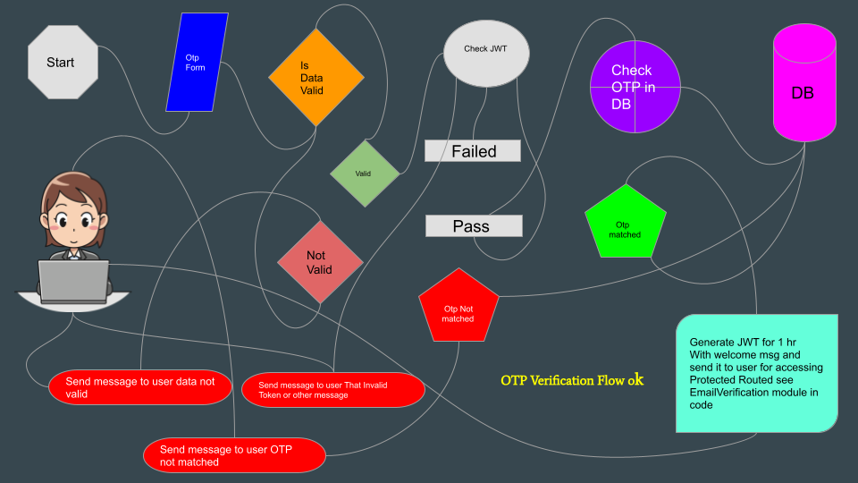
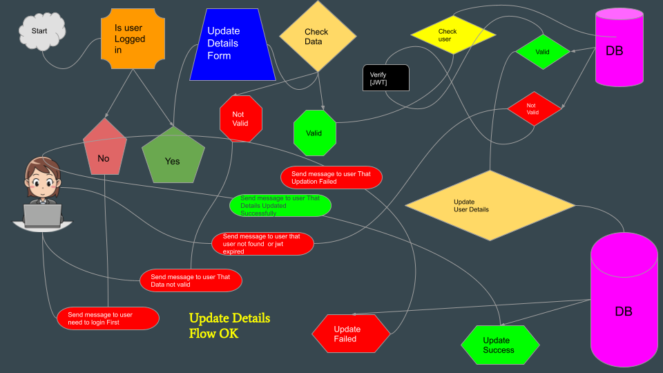
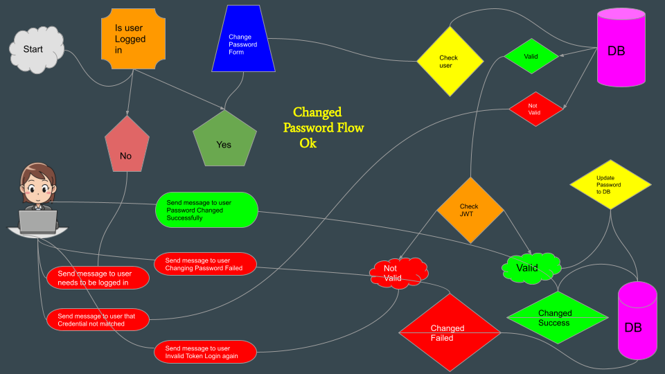
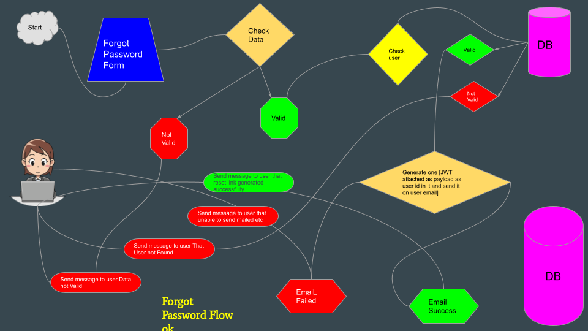
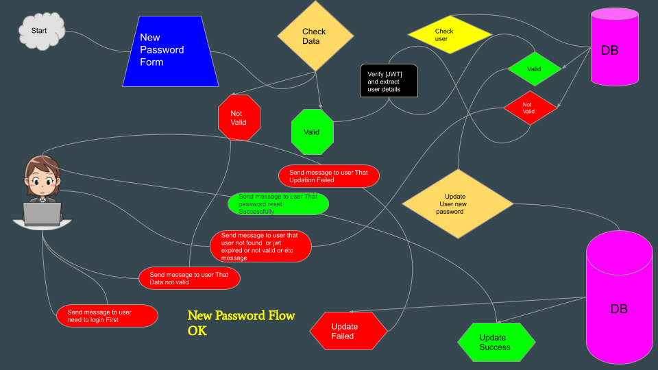

# ** Serverless [Auth System] by `Inderkant`**
# ** Technology Used Serverless Architecture , Aws Provider , Typescript , Mysql ,  Mysql Procedure**
# ** Please Help Someone by Food and Clothes **
# **Download the source code and try to learn something from this code Happy Coding _-_**

## Below are the `Screen shot of` ** Project Flow**

# ** `User Registration Flow` **

# ** `User Login Flow` **

# ** `User Email Verification or OTP verification` **

# ** `User Update Details Flow` **

# ** `User Update Password Flow` **

# ** `User Forgot Password Flow` **

# ** `User New Password Flow by Email Link` **

